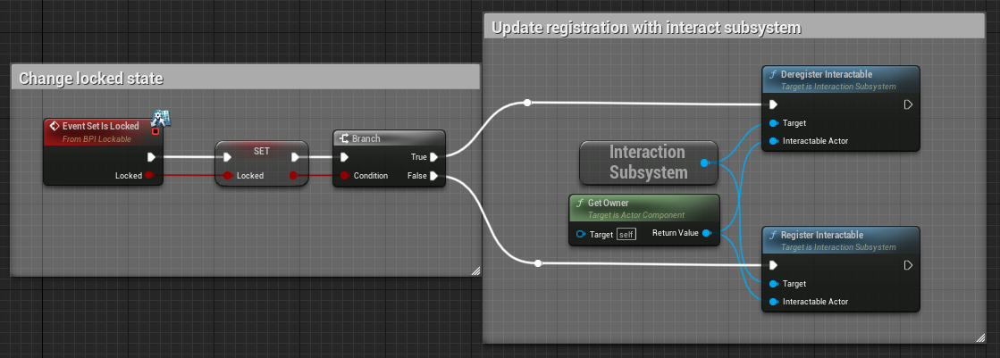
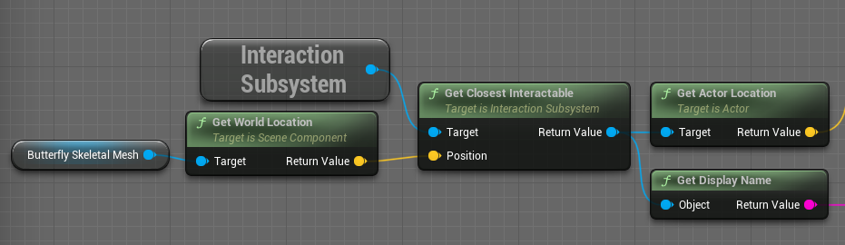
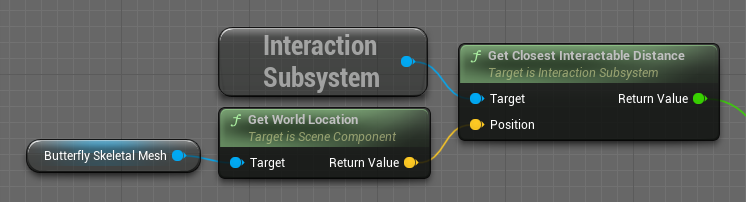

# Interaction Subsystem

Table of Contents

- [File Details](#file-details)
- [Blueprint Functions](#functions)
  - [Actor Registration](#actor-registration)
  - [Closest Interactable](#closest-interactable)

 

## File Details

| Attribute     | Description                                                  |
| ------------- | ------------------------------------------------------------ |
| Files         | `InteractionSubsystem.h` `InteractionSubsystem.cpp`     |
| Source Folder | `/Source/NaturalDisaster/Pubilc/Interaction/` `/Source/NaturalDisaster/Private/Interaction/` |
| Extends       | `UWorldSubsystem`                                            |

 

## Blueprint Functions

### Actor Registration

| Signature                                                    | Usage Example                                     |
| ------------------------------------------------------------ | ------------------------------------------------- |
| `void RegisterInteractable(AActor* InteractableActor)`  Adds the given actor to the list of active interactables. |  |
| `void DeregisterInteractable(AActor* InteractableActor)`  Removes the given actor from the list of active interactables. | See above image.                                  |

### Closest Interactable

| Signature                                                    | Usage Example                                        |
| ------------------------------------------------------------ | ---------------------------------------------------- |
| `AActor* GetClosestInteractable(FVector Position)`  Returns the actor in the active interactables list that is closest to the given world position. |     |
| `float GetClosestInteractableDistance(FVector Position)`  Finds the actor in the active interactables list that is closest to the given world position, and returns the distance between that actor and the given position. |  |

