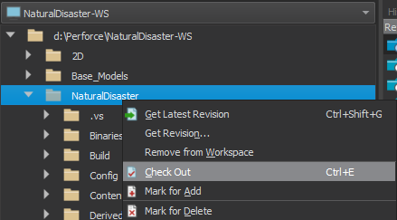
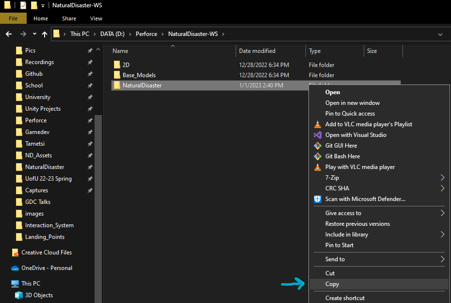
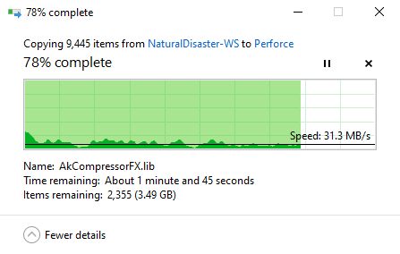
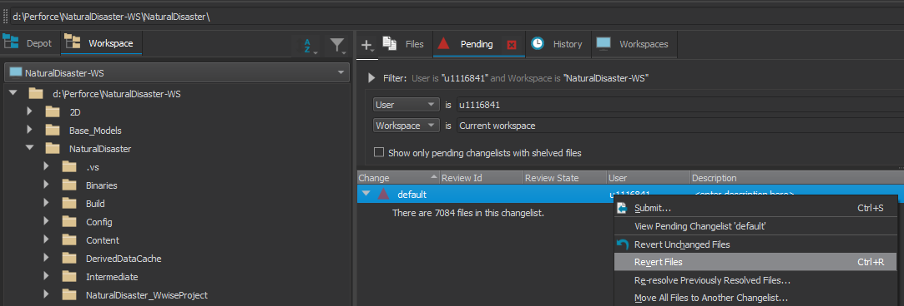
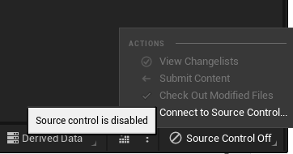
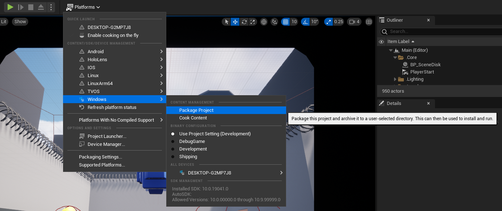
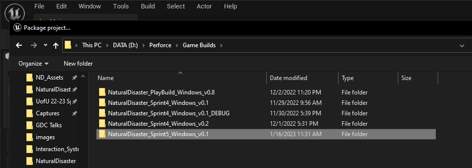
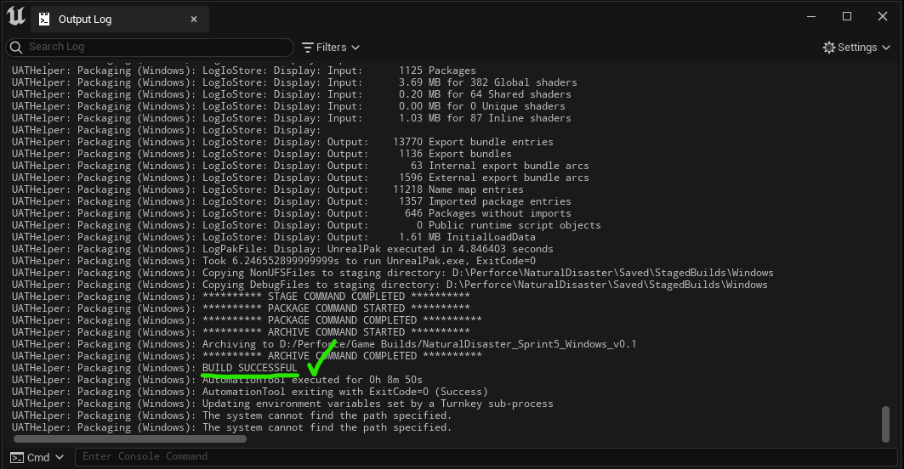
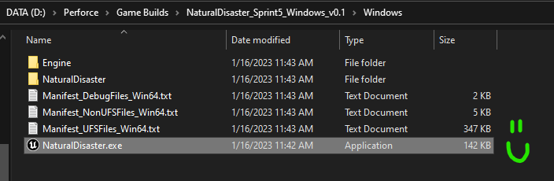

# How to Make a Build

Table of Contents

- [Build Steps](#build-steps)
- [Troubleshooting](#troubleshooting)
  - [Regenerate Project Files](#regenerate-project-files)

## Build Steps

| Step                                                         | Image                                                        |
| ------------------------------------------------------------ | ------------------------------------------------------------ |
| **1. Check out the entire 'Natural Disaster' folder in Perforce** |                              |
| **2. Copy the 'Natural Disaster' folder to another location**  This should be somewhere outside of your Perforce workspace. |   |
| **3. Revert your change list in Perforce to check everything back in**  Note: This will take much more time than step 1, so don't panic if it doesn't complete right away. |                                |
| **4. Launch the <u>copy</u> of the project**  Just to be safe, disable source control (in the bottom right) to ensure Perforce doesn't interfere with the build process. |                         |
| **5. Package the project**  If building for a playtest, a development build (use project settings) is fine. Otherwise, choose shipping build. |                               |
| **6. Pick a folder for the build**  Make a new folder for the build - a good naming convention is `NaturalDisaster_[Sprint]_[Platform]_[Version]`, where the version number is specific to the current sprint.   Example: `NaturalDisaster_Sprint5_Windows_v0.1` |                                |
| **7. Wait for the build to complete**  If all goes well, there should be no build errors. Once this step finishes, you should be able to find and launch the executable in the folder you specified.  Congratulations, you made a build! |   |

 

## Troubleshooting

If you're encountering errors while trying to package the project, here are some common things that can help:

### Regenerate Project Files

- Close the engine
- Delete the following directories from the project folder:
  - `Build`
  - `DerivedDataCache`
  - `Intermediate`
  - `Saved`
- Re-open the engine - the deleted folders should automatically be rebuilt
- From here, you can try packaging the project again with the freshly regenerated files

