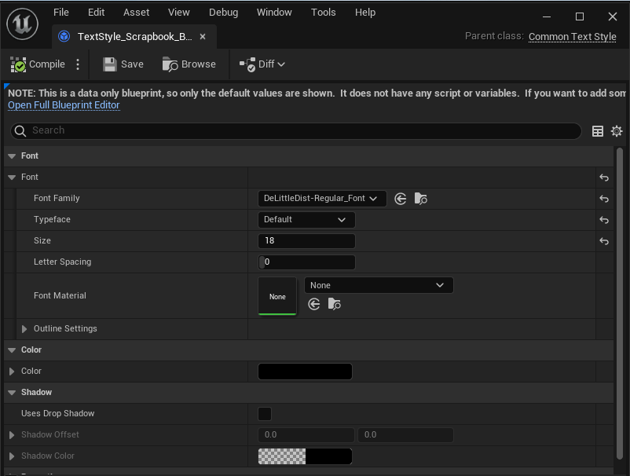

# Guide: Using Common UI

*Written by: Marissa Angell*

 

Table of Contents

- [Quick Reference](#quick-reference)
- [Tutorials](#tutorials)
  - [Styling Text](#styling-text)
  - [Styling Buttons](#styling-buttons)
  - [Creating a New Button Widget](#creating-a-new-button-widget)

- [Additional Resources](#additional-resources)

 

## Quick Reference

- [[Styling Text](#styling-text)]: To change the font, size, or color of text, make a new `TextStyle` asset and apply it to the text block. 
- [[Styling Buttons](#styling-buttons)]: To change the backgrounds used for a button in its various states, make a new `ButtonStyle` asset and apply it to a `UI_Default_Button` widget.
  - If you need to add more child widgets or variables to a button, then refer to [Creating a New Button Widget](#creating-a-new-button-widget).

 

## Tutorials

### **Styling Text**

| Step Description                                             | Image                                                        |
| ------------------------------------------------------------ | ------------------------------------------------------------ |
| 1. Create a new blueprint class with a parent class of `CommonTextStyle`.    *When naming your new class, use the prefix 'TextStyle_' (ex: TextStyle_Scrapbook_Header).* |                    |
| 2. Edit the fields on your new `TextStyle` asset.    *Usually, you'll just want to change the Font Family, Size, and Color fields, but you can also do things like add an outline or drop shadow here if desired.* |                                 |
| 3. Create a new Common Text widget.   *TextStyle assets only work with CommonUI classes, such as the 'Common Text' widget. If the text you are wanting to change does not derive from one of those classes, then you will need to replace it.* |                               |
| 3. Apply the style to your text.                             |   |

 

### **Styling Buttons**

| Step Description                                             | Image                            |
| ------------------------------------------------------------ | -------------------------------- |
| 1. Create a new blueprint class with a parent class of `CommonButtonStyle`.     *When naming your new class, use the prefix 'ButtonStyle_' (ex: ButtonStyle_Scrapbook)* |  |
| 2. Edit the fields on your new `ButtonStyle` asset.    *Note: due to a quirk in how the class is implemented, the TextStyle fields here <u>do not work</u>. The workaround for this is adding an exposed field in the button widget itself, which has been done in the UI_Default_Button widget class.* |  |
| 3. Create a new UI_Default_Button widget.   *ButtonStyle assets only work with CommonUI classes, such as UI_Default_Button. If you need a button with more than just a text label on it, refer to [Creating a New Button Widget](#creating-a-new-button-widget) to make a new custom class of button.* |  |
| 4. Apply the style to your button.    *If you're using UI_Default_Button, you should also see a Text Style field, which is used as a workaround for the quirk discussed in step 2. Use this field to change the TextStyle asset that is applied to the button.* |  |

 

### **Creating a New Button Widget**

#### Preface

You should only need to create a new button widget if you need a button that either:

- Will have something **other than just text** on it
- Needs to **store its own variables**

If you are trying to create a button that just has a text label on it, but that uses different colors or has a different text font or background image, then you should refer to the [Styling Text](#styling-text) and [Styling Buttons](#styling-buttons) sections of this guide.  

 

#### Custom Button Classes

- In order to mesh with the CommonUI system, your custom button class must extend from `CommonButtonBase`.
- As a shortcut for getting a foundation to build on, feel free to duplicate the `UI_Scrapbook_Character_Button` widget, found under `/Core/UI/Scrapbook/`.
  - This widget both adds an image and additional exposed variables on top of the basic button class, so it is a good example to study if you want to do similar.

 

## Additional Resources

### Text

- Unreal Engine: [Common UI Official Documentation](https://docs.unrealengine.com/5.0/en-US/common-ui-plugin-for-advanced-user-interfaces-in-unreal-engine/)
- BenUI: [Introduction to Common UI](https://benui.ca/unreal/common-ui-intro/)

### Video

- Unreal Engine: [Introduction to Common UI | Inside Unreal](https://www.youtube.com/watch?v=TTB5y-03SnE) (2:41:30)
- Isbushka Oji: [Common UI tutorial - easy gamepad UI in Unreal Engine 5](https://www.youtube.com/watch?v=uQisYatymjg) (55:16)

