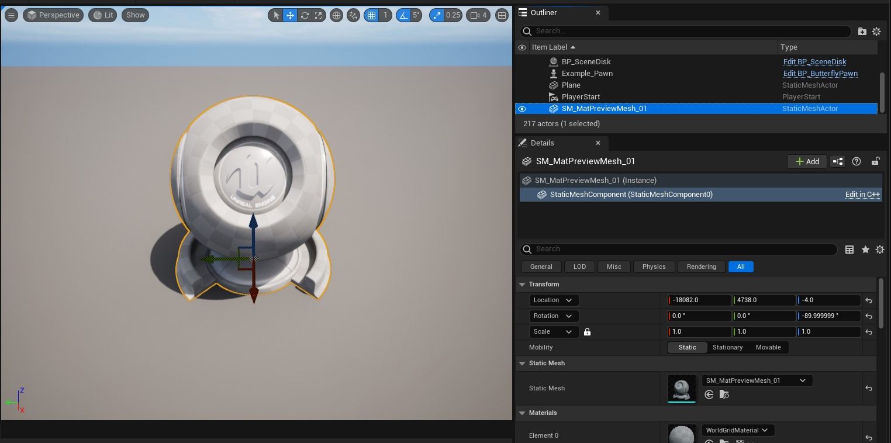
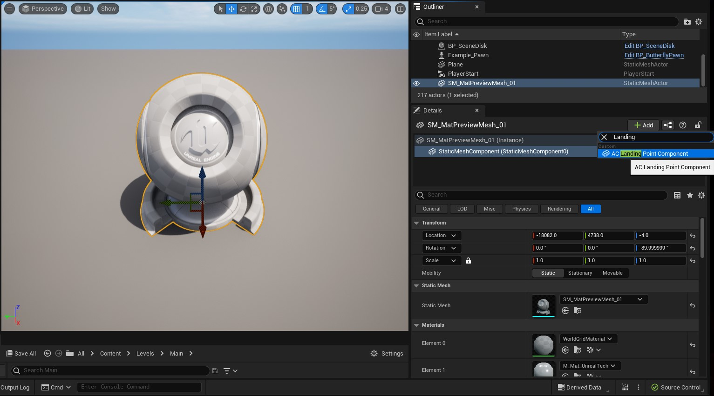
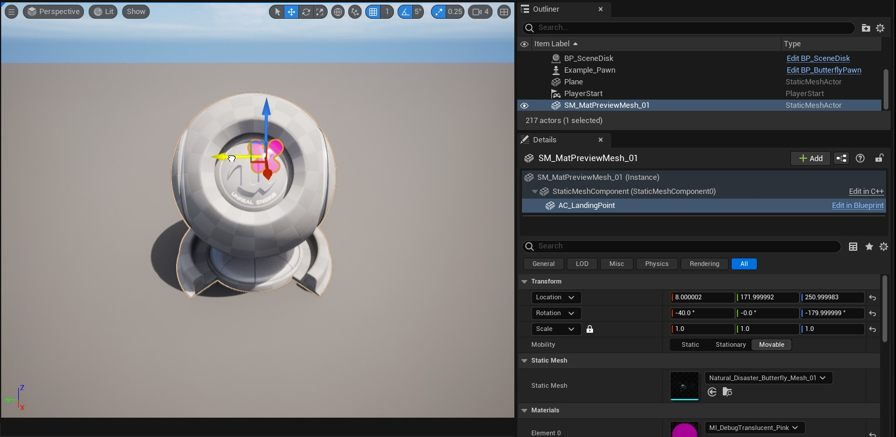
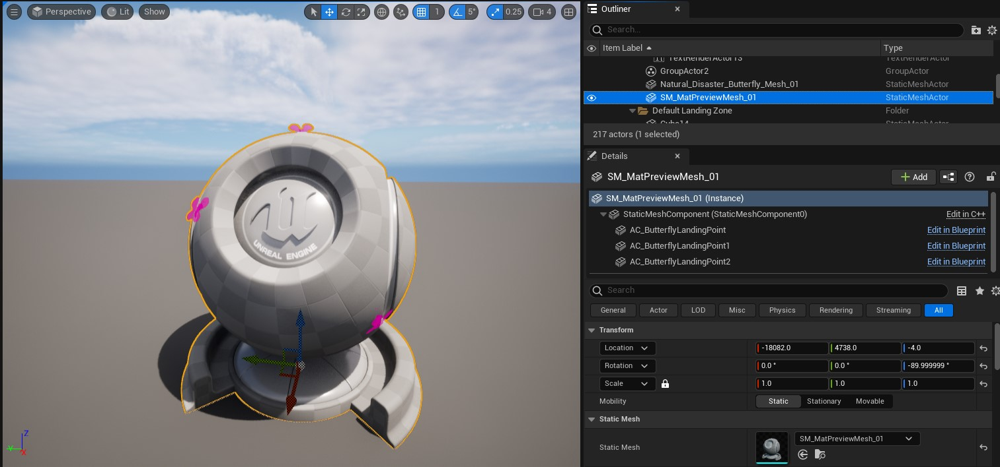
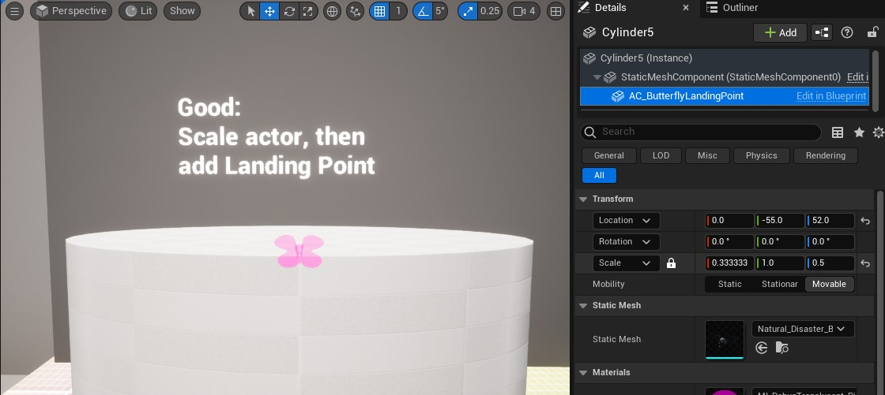
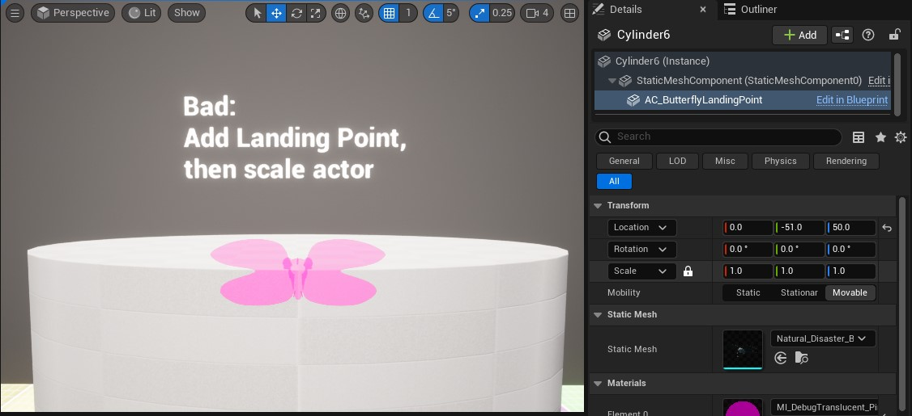
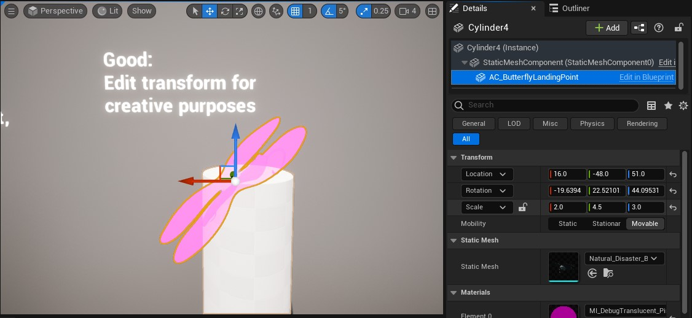

# Guide: Using Landing Points

*Written by: Marissa Angell*

 

Table of Contents

- [Adding Landing Points to an Object](#adding-landing-points-to-an-object)
- [Do's and Don'ts for Landing Point Scale](#dos-and-donts-for-landing-point-scale)

 

## Adding Landing Points to an Object

| Step Description                                             | Image                            |
| ------------------------------------------------------------ | -------------------------------- |
| 1. Select the object you want to add the landing point to by clicking on it.   Once selected, you should be able to see the object's details in the `Details` panel of the Unreal Editor. |  |
| 2. With the object selected, click on the `Add` button to the right of the object's name in the `Details` panel.   Type "Landing" in the dropdown menu that opens to search for the Landing Point Component and add it to the object. |  |
| 3. When the Landing Point Component has been added to the object, a pink butterfly will appear as a preview of where the butterfly will land in-game.  Use the `Move`, `Rotate`, and `Scale` tools to change the location of the landing point on the object. |  |
| 4. If you would like an object to have multiple landing points, add additional Landing Point Components to the actor by repeating steps 1-3. |  |

 

## Do's and Don'ts for Landing Point Scale

If you scale an object that has a landing point attached to it, then the landing point will also be scaled. Since the in-game butterfly will try to match how the pink butterfly preview looks when landing on a landing point, this can lead to accidental stretching of the player butterfly. Here are some tips for how to avoid issues with scale:

| Tip                                                          | Image                              |
| ------------------------------------------------------------ | ---------------------------------- |
| <u>Good:</u> Scale an object to its correct size, and then add a landing point.  When adding a landing point to a scaled object, its relative scale will automatically adjust in order for it to appear normal.  Notice that in the image, the preview butterfly's scale is uneven, but it looks correct. |  |
| <u>Bad:</u> Add a landing point to an object, and then change the object's scale.  Changing the scale of an object with a landing point will also scale the landing point.   The easiest way to fix this is by adding a new landing point to the object and moving it back to the desired relative location. |  |
| <u>Good:</u> Intentionally scale the landing point component in order to stretch the in-game butterfly for creative purposes.  Feel free to skew the transform on purpose to make the in-game butterfly grow/shrink or squash/stretch when it lands on the landing point. |  |

 

